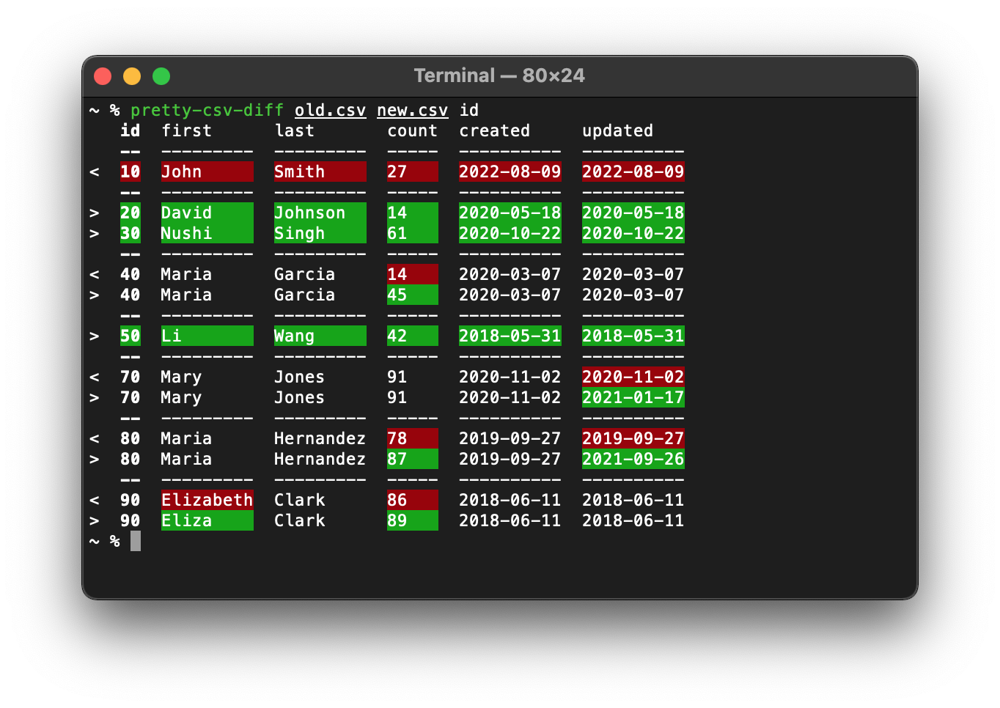

# pretty-csv-diff

Compare two CSV files for differences. Colorize the differences and align the columns.

## Command-Line Example



## Command-Line Usage

```
usage: pretty-csv-diff [-h] path path pk [pk ...]

positional arguments:
  path        paths to the two csv files to be compared
  pk          name or index of primary key column. multiple columns are
              allowed

optional arguments:
  -h, --help  show this help message and exit
```
